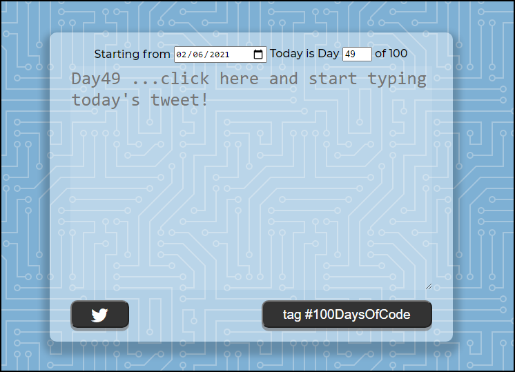

# 100DaysOfCode2Twitter



> A javascript quote generator.

---

## Link To Project

See the [Quote Maker](https://lundeen-bryan-100DaysOfCode2Twitter.netlify.app/) on Netlify.

---

## Table of Contents

[brief table of contents description].

- [Description](#description)
- [How To Use](#how-to-use)
- [References](#references)
- [Contributions](#contributions)
- [License](#license)
- [Author Info](#author-info)

---

## Description

description tbd

### Technologies

- HTML/CSS
- Vanilla Javascript

[Back To The Top](#100DaysOfCode2Twitter)

---

## How To Use

tbd

### Quotable.io is the API reference returns in json format
<br/>

```html
    tbd
```

[Back To The Top](#100DaysOfCode2Twitter)

---

## References

tbd

[Back To The Top](#100DaysOfCode2Twitter)

---

## Contributions

tbd

<br/>

### Project Status

tbd

[Back To The Top](#100DaysOfCode2Twitter)

---

## License

<mitlicense>
Copyright &copy; [2021] [Bryan Lundeen]
<br/><br/>
MIT License
Permission is hereby granted, free of charge, to any person obtaining a copy of this software and associated documentation files (the "Software"), to deal in the Software without restriction, including without limitation the rights to use, copy, modify, merge, publish, distribute, sublicense, and/or sell copies of the Software, and to permit persons to whom the Software is furnished to do so, subject to the following conditions:
<br/><br/>
The above copyright notice and this permission notice shall be included in all copies or substantial portions of the Software.
<br/><br/>
THE SOFTWARE IS PROVIDED "AS IS", WITHOUT WARRANTY OF ANY KIND, EXPRESS OR IMPLIED, INCLUDING BUT NOT LIMITED TO THE WARRANTIES OF MERCHANTABILITY, FITNESS FOR A PARTICULAR PURPOSE AND NONINFRINGEMENT. IN NO EVENT SHALL THE AUTHORS OR COPYRIGHT HOLDERS BE LIABLE FOR ANY CLAIM, DAMAGES OR OTHER LIABILITY, WHETHER IN AN ACTION OF CONTRACT, TORT OR OTHERWISE, ARISING FROM, OUT OF OR IN CONNECTION WITH THE SOFTWARE OR THE USE OR OTHER DEALINGS IN THE SOFTWARE.
<br/><br/>
<mitlicense>
<!—
<dmca>
Protection: All original content on https://github.com/lundeen-bryan/ is created by the website owner or published under permission including but not limited to text, design, code, images, photographs and videos are considered to be the Intellectual Property of the website owner, whether copyrighted or not, and are protected by DMCA Protection Services using the Digital Millennium Copyright Act Title 17 Chapter 512 (c)(3). Reproduction or re-publication of this content is prohibited without permission.
<br/><br/>
Digital Millennium Copyright Act: Part of the US Copyright Law. The DMCA addresses penalties for copyright infringement on the Internet and protects content creators by "establishing procedures for proper notification" to OSPs when copyright infringement is identified online. Online Copyright Infringement Liability Limitation Act, Title II of the DMCA "adds a new section 512 to the Copyright Act to create four new limitations on liability for copyright infringement by online service providers." These procedures allow content creators or their designated agent to file proper DMCA Takedown notice to the OSP in case infringed material has been detected on their servers.
<br/><br/>
Please see [GitHub’s](https://docs.github.com/en/github/site-policy/dmca-takedown-policy) DMCA Policy for further details.
<dmca>
-->

[Back To The Top](#100DaysOfCode2Twitter)

---

## Author Info

- Github - [lundeen-bryan](https://github.com/lundeen-bryan)
- LinkedIn - [BryanLundeen](https://www.linkedin.com/in/bryanlundeen/)
- Twitter – [@LundeenBryan](https://twitter.com/LundeenBryan)
- Facebook – [realbryanlundeen](https://www.facebook.com/realbryanlundeen)

[Back To The Top](#100DaysOfCode2Twitter)

